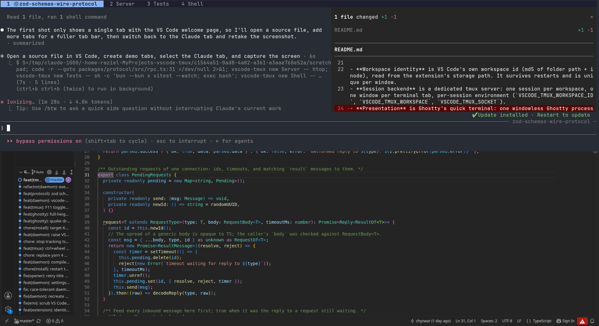

# VS Code Tmux

A quake-style Ghostty dropdown (`ctrl+\``) that always shows the terminals of the VS Code window you are working in.



## Why

Terminals should belong to the project, not to the window. An editor window is a view you open and close; the dev server, the test watcher and the Claude Code agent you started an hour ago are work in progress that has no business dying with it.

- **Your processes outlive VS Code.** Every workspace gets its own tmux session. Close the window, reboot the extension host, crash the editor: the shells, servers and agents keep running. Open the project again and the same tabs are there.
- **One key, always the right terminal.** `ctrl+\`` drops the terminal down from the top of the screen, over whatever you are doing, and it already shows the tabs of the VS Code window that has focus. Switch windows and the dropdown follows, without restarting anything.
- **Agents that run for hours stay reachable.** Claude Code sessions live in tabs. The tab label shows what the agent is working on. Switch to another project, come back, and it is still there, still running.
- **The terminal knows which window it belongs to.** `vscode src/App.tsx:42:8` from any tab opens that file in that project's window and raises it. Click a path in compiler output and the same thing happens.
- **No new terminal to learn.** The dropdown is Ghostty, the tabs are tmux, VS Code is unchanged. Everything you already know keeps working.
- **One binary, one socket, no runtime to install.** The daemon ships as a single Bun-compiled executable and talks NDJSON over a Unix socket, validated with zod on both ends.

Built for Kubuntu 26.04 (Plasma 6, Wayland). It uses what the desktop already provides: Ghostty's quick terminal, the XDG global-shortcuts portal for the hotkey, and KWin scripting over D-Bus to raise windows.

- Press `ctrl+\`` anywhere: Ghostty slides down from the top with the terminals of the focused VS Code window as tabs `[ Claude ] [ Server ] [ Shell ]`. Press it again to send it away.
- Focus VS Code window A: the dropdown shows A's terminals.
- Focus window B: it switches to `[ Claude ] [ Tests ]`, whether it is on screen or hidden. Nothing is restarted; every process keeps running.
- Close a VS Code window: its Claude Code agents, dev servers and shells keep running in tmux. Reopen the project and it reattaches.
- In any terminal: `vscode src/App.tsx:42:8` opens that file at that position in the VS Code window the terminal belongs to, and raises it.

## How it works

```
VS Code window A --ext--+                             +-- tmux server (-L vscode-tmux)
VS Code window B --ext--+   unix socket (NDJSON)      |     session project-a-<id>: [Claude][Server][Shell]
                        +------- daemon --------------+     session project-b-<id>: [Claude][Tests]
`vscode file:12` CLI ---+          |                  |     session lobby
                                   | launches         +-- one client = the Ghostty surface
                                   +-- ghostty --class=dev.vscodetmux.Ghostty (single surface, tmux draws the tabs)
```

- **Workspace identity** is VS Code's own workspace id (md5 of folder path + inode), read from the extension's storage path. It survives restarts and is unique per window.
- **Session backend** is a dedicated tmux server: one session per workspace, one window per terminal tab, per-session environment (`VSCODE_TMUX_WORKSPACE_ID`, `VSCODE_TMUX_WORKSPACE`, `VSCODE_TMUX_SOCKET`).
- **Presentation** is Ghostty's quick terminal: one windowless Ghostty process (own class, own config, started by the systemd user unit `app-dev.vscodetmux.Ghostty.service`) whose dropdown surface runs one tmux client. `ctrl+\`` is a Ghostty `global:` keybind registered through the XDG GlobalShortcuts portal, so the compositor delivers it wherever you are. The tab bar is tmux's status line (click to select, `alt+1..9`, `ctrl+wheel` or wheel over the bar to cycle, `ctrl+t`/`alt+t` new tab, `alt+r` rename, `alt+w` close). While Claude Code runs in a tab, the tab shows the title Claude sets (what it is working on); the window name underneath is unchanged, and `alt+r` pins a name over it. See `docs/adr/0004-quake-dropdown-via-ghostty-quick-terminal.md`.
- **Clicking a path** goes through tmux (`#{mouse_word}` / `#{mouse_hyperlink}`, `#{pane_current_path}`, `#{session_name}`) into `vscode-tmux click`, which resolves the path, checks it exists and hands it to the same opener as the `vscode` CLI. The session name is what maps the click back to a VS Code window: a mouse binding runs outside the shell and never sees its environment.
- **A focus change** switches the attached client with `tmux switch-client`, and parks the session in a `client-attached`/`session-created` hook for the client that attaches the next time you pull the dropdown down. The daemon cannot open the dropdown itself — Ghostty 1.3 has no IPC for it — so the terminal appears only when you ask for it.
- **Daemon** (TypeScript, shipped as one Bun-compiled Linux x64 binary at `~/.local/bin/vscode-tmux`) is auto-started by the extension (via a transient systemd user unit when available) and owns the registry, the tmux server, the Ghostty process and file-open routing. See `docs/adr/0002-compiled-bun-daemon.md`.
- **Raising a VS Code window** (`vscode file:12` from a terminal) goes through the compositor: on Plasma the daemon loads a small KWin script over D-Bus (`busctl`, no extra tool) that activates the window by title, then confirms through the extension that the window took focus. VS Code is a native Wayland window since Electron 38.2, so X11 tools cannot see it; `xdotool` is only used in X11 sessions. See `docs/adr/0003-raise-via-kwin-scripting.md`.

Why not native Ghostty sessions or native tabs: they do not exist / cannot be driven externally yet. See `docs/adr/0001-session-backend-and-presentation.md` and `docs/research/`. The backend and presenter are interfaces so kitty native tabs, or Ghostty sessions once they land upstream, can be added later.

## Install

Requirements: Ubuntu/Debian-like Linux (x64), Ghostty 1.3+ (the dropdown needs global keybinds on GTK; `install.bash` takes it from apt, or the snap), VS Code, Bun >= 1.3 (installed by `install.bash` if missing; it is the package manager, the daemon compiler and the runtime for tsc, esbuild, vitest and vsce — no Node needed). Target desktop: Kubuntu 26.04 (Plasma 6.6, Wayland only); it also runs on Ubuntu 22.04 GNOME 42 Wayland, where windows cannot be raised (see Limitations).

```bash
git clone <this repo> ~/MyProjects/vscode-tmux
cd ~/MyProjects/vscode-tmux
./install.bash            # apt tmux (+ghostty on 26.04, else the snap), VS Code .deb, bun install + build,
                          # daemon binary, configs, the companion's user unit + desktop entry, extension
```

Options: `--no-apt`, `--no-vscode-deb`, `--force-config`, `--snap-ghostty`. Then reload your VS Code windows and press `ctrl+\``.

The first time the companion starts, Plasma registers its global shortcut (accept the prompt if you get one); it then lives in System Settings > Shortcuts as `CTRL+grave`. `vscode-tmux status` shows whether it is bound.

Manual equivalent: `bun install && bun run build`, copy `packages/daemon/dist/vscode-tmux` to `~/.local/bin/vscode-tmux`, symlink `packages/daemon/bin/vscode` to `~/.local/bin/vscode`, copy `config/*.conf` to `~/.config/vscode-tmux/`, `config/dev.vscodetmux.Ghostty.desktop` to `~/.local/share/applications/`, `config/app-dev.vscodetmux.Ghostty.service` to `~/.config/systemd/user/` (`systemctl --user enable --now app-dev.vscodetmux.Ghostty.service`), `code --install-extension packages/extension/vscode-tmux.vsix`. Keep both names: xdg-desktop-portal reads the application id out of the unit name and needs the matching desktop entry to attribute the shortcut. The extension only spawns the binary; the .vsix does not contain it. Put it elsewhere with the `vscode-tmux.daemonPath` VS Code setting.

## Use

- `ctrl+\`` toggles the dropdown. It is a global shortcut, so it wins over VS Code's own `ctrl+\`` (the integrated terminal) everywhere.
- **Click a file path** in any output (`src/app.ts:42:8` from tsc, eslint, a stack trace, or an OSC 8 link from ripgrep/ls/delta) with **ctrl+click or alt+click**: it opens in the VS Code window that terminal belongs to, raises that window, and sends the dropdown away. Clicking something that is not a file does nothing. Bound in `tmux.conf` — Ghostty cannot be taught new link patterns, but tmux owns the pane content and knows the word under the pointer.
- Commands: `VS Code Tmux: Create Terminal`, `VS Code Tmux: Show Session` (switches what the dropdown shows; it cannot pull it down).
- CLI: `vscode <path[:line[:col]]>` (alias of `vscode-tmux open`), `vscode-tmux new [name] [-- cmd...]`, `vscode-tmux toggle`, `vscode-tmux height`, `vscode-tmux list`, `vscode-tmux status`.
- Dropdown size and position: `quick-terminal-*` in `~/.config/vscode-tmux/ghostty.conf` (`quick-terminal-position`, `quick-terminal-size = 1048px` (screen height minus the Plasma panel; percentages overflow under a top panel), `quick-terminal-autohide` for classic hide-on-focus-loss), then `systemctl --user restart app-dev.vscodetmux.Ghostty.service`.
- F11 in the dropdown flips it between full height and a 45% strip (`vscode-tmux height`). Ghostty cannot resize or fullscreen a live quick terminal, so the daemon rewrites `quick-terminal-size`, reloads, and rebuilds the window; the tmux client reconnects in about a second. The two sizes are `ghosttyDropdownFull` and `ghosttyDropdownShort` in `~/.config/vscode-tmux/config.json` (defaults `1048px` and `45%`).
- Settings: `~/.config/vscode-tmux/config.json` (`ghosttyGdkBackend`: `auto` (default: XWayland on GNOME, native Wayland elsewhere) | `x11` | `wayland` | `default`, `ghosttyStartTimeoutMs`, `ghosttyDropdownFull` / `ghosttyDropdownShort`). VS Code setting `vscode-tmux.daemonPath` overrides the daemon binary location.
- Plasma: the companion window's app id is `dev.vscodetmux.Ghostty`, so a KWin window rule (System Settings > Window Management > Window Rules) can pin it to a screen, keep it on all desktops or drop its title bar.
- Logs: `journalctl --user -u app-dev.vscodetmux.Ghostty.service` for the companion; `~/.local/state/vscode-tmux/daemon.log`, `ghostty.log`; state snapshot `~/.local/state/vscode-tmux/state.json`; VS Code output channel "VS Code Tmux".
- Direct tmux access: `tmux -L vscode-tmux ls`.

## Limitations (current slice)

- Processes do not survive an OS reboot (tmux cannot do that). Restoring sessions, tab names, cwds and optionally commands from the snapshot is the next milestone.
- Raising the VS Code window works on Plasma (KWin scripting sees native Wayland and XWayland windows and is not subject to focus-stealing prevention) and in X11 sessions (`xdotool`). On GNOME Wayland VS Code 1.137 is a native Wayland window that no external tool can raise (only a Shell extension could); files still open and the `code --goto` fallback flashes the taskbar entry.
- Ghostty prompt features (jump to prompt, notify on command finish) do not pass through tmux.
- The dropdown needs a compositor with wlr-layer-shell (KDE, Hyprland, sway, niri) and an XDG GlobalShortcuts portal (KDE 5.27+, GNOME 48+). GNOME has the portal but not layer shell, so there the companion falls back to a normal window and would need a Shell extension to drop down.
- Nothing but the hotkey opens the dropdown: Ghostty 1.3 has no IPC for `toggle_quick_terminal`, so *Show Session* and focus changes only decide what you will see when you next pull it down. `vscode-tmux toggle` goes the long way round through kglobalaccel and is Plasma-only.
- Installed as a snap, Ghostty's shortcut is filed under the snap (`ghostty_ghostty`, shown as "Ghostty") rather than under this companion, so a second Ghostty with its own `global:` keybinds shares that component.
- The companion Ghostty runs natively on Wayland except on GNOME, where it runs under XWayland (`GDK_BACKEND=x11`): on GNOME 42 Wayland a Ghostty started by a background process never created its terminal surface when running natively (reproducible with `env -i <systemd user env> setsid -f ghostty --class=... --command=...`). Override with `ghosttyGdkBackend` in `~/.config/vscode-tmux/config.json`.

## Development

```bash
bun run test       # vitest on Bun (unit, a real-tmux integration test, and a smoke test of the compiled binary if built); not `bun test`
bun run typecheck
bun run build      # extension via esbuild; daemon via `bun build --compile` -> packages/daemon/dist/vscode-tmux
(cd packages/daemon && bun run dev)         # daemon in the foreground from source
./packages/daemon/dist/vscode-tmux daemon --foreground
```

The daemon source uses only `node:` APIs — no Bun-specific ones — so it runs unchanged on either runtime; the toolchain (`bun --bun x vitest|tsc|vsce`) and the shipped binary both run on Bun. `VSCODE_TMUX_SOCKET` overrides the socket path (tests use it for isolation).

Layout: `packages/protocol` (messages, NDJSON codec, env scrubbing), `packages/daemon` (backend, presenter, opener, `raise/` window raisers, server, CLI), `packages/extension` (VS Code extension), `config/` (tmux and Ghostty instance configs), `docs/` (ADR, research, plans).
